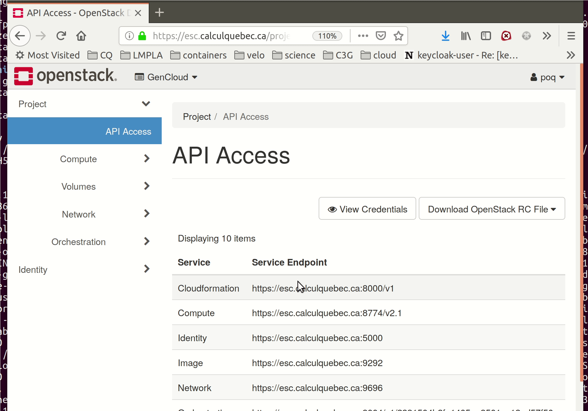

# Terraform for GenPipes on the Cloud

This is an early fork of the [Compute Canada Magic Castle project] (https://github.com/ComputeCanada/magic_castle) it is modified so it install the GenPipes software stack instead of the Compute Canada one. The fork was done at the time when magic_castle was still using its cloud init recipes. We are actively migrating it to use puppet modules.


## Local Setup

Install [Terraform](https://www.terraform.io/downloads.html)

## OpenStack

1. Clone this repo
~~~
 git clone git@github.com:c3g/genpipes_cloud.git
~~~

2. Copy the id file from openstack on your computer
> 
3. Sourcing this file
~~~
 source ./<MyProject>.openrc.sh
~~~

4. Create a new folder : `mkdir my_deploying_folder && WORKDIR=~/${PWD}/my_deploying_folder`.

5. Copy the `main.tf` file from the [openstack example folder](./examples/openstack/main.tf)
~~~
cp genpipes_cloud ${WORKDIR}
~~~

4. Set the value in the file
Give a telling name to your cluster

~~~
~~~
cluster_name        = "funky_one"

Set the firewall white list rule. You can restrict it to you current IP address for development purpose. Get your current address wit curl:

~~~
$ curl ifconfig.co
<my current ip>

~~~
then in the main.tf change `fw_ssh_filter = "<my current ip>"`

It also accept range in the following form `XXX.XXX.XXX.XXX/XX`

5. Create an ssh key for that cluster

```
$ ssh-keygen
$ cp ~/.ssh/id_rsa.pub  cloud.pub
```

6. Deploy with terraform

~~~
$ terraform init
$ terraform apply
[...]
Apply complete! Resources: 13 added, 0 changed, 0 destroyed.

Outputs:

admin_passwd = <slurm admin pw>
domain_name = greateplace.ca
guest_passwd = <user1 passwd>
public_ip = <login node ip>

~~~

7. Log to  the cluster
Genpipes takes about 20 minutes to setup, but you can login to the cluster right away.
Has the admin user, with your rsa key:
~~~
ssh centos@<login node ip>
~~~

or as user1 with the guest_passwd

~~~
ssh user1@<login node ip>
~~~

Note that Genpipes is only activated for user1.

## Verifying the cluster state

On the login node :
- Verify SLURM cluster state: `sinfo`. You should see the number of nodes defined in `variables.tf`
and all nodes should have an idle state.
- Verify you can run interactive jobs: `salloc`
- Verify the home were created: `ls /home`. You should see as many home as there are guest account + centos account.


8. Test GenPipes


9. Stop the cluster

~~~
$ terraform destroy
~~~


# these are not tested yet for GenPipes!

## Amazon Web Services

1. Create a new folder : `mkdir my_new_cluster`.
2. Copy an example `main.tf` from the [aws example folder](./examples/aws).
3. Export the following environment variables : `AWS_ACCESS_KEY_ID` and `AWS_SECRET_ACCESS_KEY`.
4. Initiate the Terraform state : `terraform init`.
5. Retrieve the Terraform OpenStack module : `terraform get`.
6. Adapt the cluster variables in the `main.tf` file (i.e.: # guest accounts, # nodes, domain name, ssh key, etc).
7. Verify the Terraform plan : `terraform plan`.
8. Apply the Terraform plan : `terraform apply`.

To tear down the cluster, from the `my_new_cluster` folder, call: `terraform destroy`.

## Azure

1. Create a new folder : `mkdir my_new_cluster`.
2. Copy the example `main.tf` from the [azure example folder](./examples/azure).
3. Go in the azure project folder : `cd slurm_cloud-1.0*/azure`.
4. Install [Azure CLI](https://docs.microsoft.com/en-us/cli/azure/install-azure-cli) if not already installed : `pip install azure-cli`.
5. Login to Azure and follow the instructions : `az login`.
6. Initiate the Terraform state : `terraform init`.
7. Retrieve the Terraform Azure module : `terraform get`.
8. Adapt the cluster variables in the `main.tf` file (i.e.: # guest accounts, # nodes, domain name, ssh key, etc).
9. Verify the Terraform plan : `terraform plan`.
10. Apply the Terraform plan : `terraform apply`.

To tear down the cluster, from the `my_new_cluster` folder, call: `terraform destroy`.

## GCP

1. Create a new folder : `mkdir my_new_cluster`.
2. Copy the example `main.tf` from the [gcp example folder](./examples/gcp).
3. Follow these [steps](https://www.terraform.io/docs/providers/google/index.html#authentication-json-file) to download your credentials as a JSON file.
4. Initiate the Terraform state : `terraform init`.
5. Retrieve the Terraform GCP module : `terraform get`.
6. Adapt the cluster variables in the `main.tf` file (i.e.: # guest accounts, # nodes, domain name, ssh key, etc).
7. Verify the Terraform plan : `terraform plan`.
8. Apply the Terraform plan : `terraform apply`.

To tear down the cluster, from the `my_new_cluster` folder, call: `terraform destroy`.

## OVH

1. Create a new folder : `mkdir my_new_cluster`.
2. Copy an example `main.tf` from the [ovh example folder](./examples/ovh).
3. Download your project OpenStack RC File v3 (v2 won't work) from the [OVH OpenStack interface](https://horizon.cloud.ovh.net/project/) at the top right corner of the page.
4. Source your project openrc file : `source _project_-openrc.sh`.
5. Initiate the Terraform state : `terraform init`.
6. Adapt the cluster variables in the `main.tf` file (i.e.: # guest accounts, # nodes, domain name, ssh key, etc).
7. Verify the Terraform plan : `terraform plan`.
8. Apply the Terraform plan : `terraform apply`.

To tear down the cluster, from the `my_new_cluster` folder, call: `terraform destroy`.

## Using Cloudflare DNS Service

1. Create a symlink to the `dns.tf` file into your cloud project folder (i.e: `openstack`, `aws`, etc.).
2. Export the following environment variables `CLOUDFLARE_EMAIL` and `CLOUDFLARE_TOKEN`.
3. Run `terraform apply`.
